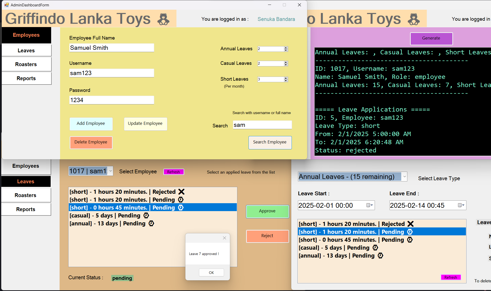

# Griffindo Leave Manager

This project was written as a part of my university assignments. It's a simple CRUD operation software that manages employee leaves using a centralized database system.

The project consists of 2 user types:

* Adminstrator
* Employee

Each of them have two separate interfaces for interacting with the database.

## Screenshots

## Tools & Technologies Used

* C#
* WinForms with .NET Framework
* Visual Studio
* SQL Server
* SQL Server Management Studio

## Feature Implementation

- [x] Login for admin
- [x] Login for employee
- [x] Employee > Apply Leaves
- [x] Employee > Leave Validation (partially complete)
- [x] Employee > View Leave status
- [x] Employee > Delete Apply Leaves
- [ ] Employee > View Leave Apply History
- [x] Admin > Register Employee
- [x] Admin > Define number of annual leaves
- [x] Admin > Define number of casual leaves
- [x] Admin > Define number of short leaves
- [x] Admin > Define roasters
- [x] Admin > Approve leaves
- [x] Admin > Reject leaves
- [ ] Admin > Individual Employee Report 
- [x] Admin > All Employee Report
- [ ] Admin > All Employee Report for time range

## Assignment Brief

Grifindo Lanka Toys is a small-scale Toy building company which is in Sri Lanka and
currently they have 20 employees working at this company. Grifindo Lanka Toys is the Sri
Lankan branch of Grifindo Toys Company which is in UK and previously they have hired your
freelance company to develop their payroll system and now they are hiring you again to
develop their leave management system for the Sri Lankan branch, Grifindo Lanka Toys
Company.

This leave management system has two user roles, and they are Employee and Admin, and they
are having two separate desktop applications to interact with the centralized database. Developer
can consider the centralized database as a local database for the development purposes.

Functional requirements for the Employee and Admin as follow.

1. Employee Application.

• Employee should be able to login to the system with the employee number and
the given password.

• Employee should be able to apply for a leave through the system.
Note:- Normally an employee has 14 annual leaves, 7 casual leaves for a year and
2 shorts leaves per a month. Employee can apply casual leaves as they want
before their defined roaster starts. Annual leaves can be applied before 7 days
prior to the leave date. Short leave duration is 1 hour and 30 minutes and can be
applied for up coming time slots.

• Employee can view the status of applied leaves (Whether applied leaves are
approved or not).

• Employee can delete applied leaves.

• Employee can view their remaining leaves and history of applied leaves.

2. Admin Application

• Admin should be able to login to the leave management system.

• Admin should be able to register new employees to the system.

• Admin should be able to define the number of annual leaves, casual leaves for a
year and 2 short leaves per every month for every employee. (Newly joined
employees will less number of leaves compared to permanent employees)

* Admin should be able to define the roaster starting time and end time for each
employee.

• Admin should be able to approve or reject applied leaves of each employee.

• Admin should be able to view leave reports of,

	* Individual employee leave history for a given date range.
	* All employees leave history for a given date range.